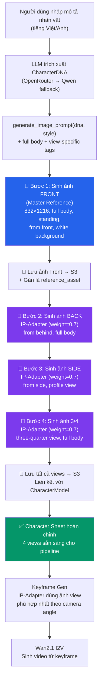

# Nâng Cấp Hệ Thống Sinh Ảnh Nhân Vật — Character Reference Sheet Đa Góc Nhìn

## Bối Cảnh & Mục Tiêu

Hiện tại, hệ thống chỉ sinh **1 ảnh portrait duy nhất** (832×1216) cho mỗi nhân vật — thường là góc nhìn mặt trước, nửa thân. Khi đưa ảnh này vào pipeline Image-to-Video (Wan2.1), AI thiếu thông tin về phần lưng, tóc phía sau, trang phục toàn thân, giày dép,... dẫn tới video bị "drift" (trôi hình dạng) và nhân vật thiếu nhất quán giữa các shot.

**Mục tiêu:** Tạo ra một **bộ ảnh tham chiếu đa góc nhìn (Character Reference Sheet)** cho mỗi nhân vật, bao gồm:
- Ảnh **toàn thân mặt trước** (front full-body) — "master" reference
- Ảnh **toàn thân mặt sau** (back view) 
- Ảnh **toàn thân góc 3/4** (three-quarter view)
- Ảnh **toàn thân nghiêng** (side view)

Bộ ảnh này sẽ phục vụ trực tiếp cho IP-Adapter khi sinh keyframe và tăng chất lượng video đầu ra.

---

## Tình Trạng Hiện Tại (Vấn Đề Phát Sinh)

> [!WARNING]
> ### Lỗi IP-Adapter kéo giãn (Drag)
> Phương án sinh tuần tự từng ảnh bằng IP-Adapter (Phương án A trong kế hoạch cũ) đã **THẤT BẠI** trong việc tạo ra các góc nhìn lưng (back) và nghiêng (side) thực sự. 
> **Nguyên nhân:** IP-Adapter (weight 0.75) hoạt động quá mạnh để giữ nhận dạng nhân vật (identity), dẫn đến việc nó "ép" AI phải vẽ lại khuôn mặt và phần trước trang phục ngay cả khi prompt yêu cầu `from behind` (từ phía sau). Kết quả là ảnh "back" hay "side" vẫn trông như ảnh chụp từ phía trước.
>
> Việc thêm ControlNet (OpenPose) có thể giải quyết việc này, nhưng sẽ làm **quá tải VRAM** của RTX 3060 (hiện tại đã rất chật vật).

---

## Giải Pháp Đề Xuất Mới (Để đảm bảo ĐỒNG BỘ MỌI THỨ ở MỌI GÓC NHÌN)

> [!IMPORTANT]
> ### Chuyển sang "Single Image Character Sheet" + Auto Crop
> Thay vì sinh 4 ảnh rời rạc, ta sẽ yêu cầu ComfyUI sinh **1 ảnh phong cảnh (Landscape - ví dụ 1536x1024)** với prompt đặc biệt: `"character design sheet, multiple views, turnaround, front view, side view, back view, same character"`.
> 
> **Lợi ích:**
> - **Đồng bộ hoàn hảo 100%:** AI (Animagine XL 4.0) có khả năng tự động hiểu "character sheet" là cùng một người, nó sẽ tự động đồng bộ trang phục, tóc, phụ kiện từ mặt trước ra mặt sau một cách logic nhất *trong cùng một lần sinh ảnh*.
> - **Đúng góc nhìn:** Không bị IP-Adapter kéo mặt ra sau lưng. Chắc chắn sẽ có mặt lưng và mặt nghiêng.
> - **Tiết kiệm VRAM & Thời gian:** Chỉ sinh 1 hình ảnh duy nhất (mất ~1-2 phút) thay vì chạy IP-Adapter 4 lần (mất 4-5 phút).
>
> **Cách xử lý sau khi sinh:**
> Sau khi sinh xong 1 ảnh dài chứa 3-4 góc nhìn, hệ thống (bằng Python/OpenCV) sẽ tự động **cắt (crop)** hình ảnh đó ra thành các ảnh rời (front, back, side) và lưu vào S3 như bình thường.

## User Review Required

> [!IMPORTANT]
> ### Bạn có đồng ý chuyển sang phương pháp "1 Ảnh Character Sheet + Cắt Tự Động" không?
> Đây là phương pháp tối ưu nhất hiện nay cho RTX 3060 để đảm bảo tính đồng bộ tuyệt đối về trang phục mà vẫn có đúng góc nhìn lưng/nghiêng. Nếu bạn đồng ý, mình sẽ tiến hành:
> 1. Xóa bỏ workflow `character_reference.json` (dùng IP-Adapter gây lỗi).
> 2. Tạo workflow mới `character_sheet.json` sinh ảnh landscape (1536x1024).
> 3. Viết code Python tự động nhận diện và cắt (crop) nhân vật ra thành 4 ảnh riêng lẻ.

---

## Proposed Changes

### Tổng Quan Luồng Hoạt Động Mới



---

### Component 1: Shared Schema & Database Model

#### [MODIFY] [character.py](file:///home/dat/pipeline/video_automation/packages/shared/ai_2d_shared/character.py)

Mở rộng `CharacterDNA` với các trường mới phục vụ full-body:

```diff
 class CharacterDNA(BaseModel):
     age: int | None = None
     gender: str | None = None
     hair_style: str | None = None
     hair_color: str | None = None
     eye_shape: str | None = None
     eye_color: str | None = None
     face_shape: str | None = None
     skin_tone: str | None = None
     height: str | None = None
     build: str | None = None
     clothing_style: str | None = None
+    lower_clothing: str | None = None       # quần/váy/chân váy
+    footwear: str | None = None             # giày/dép/ủng
+    back_details: str | None = None         # chi tiết phía sau (tóc thả, cánh, ba lô,...)
+    accessories: list[str] = []             # phụ kiện (vòng cổ, vòng tay, thắt lưng,...)
     distinctive_features: list[str] = []
     personality_traits: list[str] = []
```

Mở rộng `CharacterRead` để trả về danh sách các view assets:

```diff
 class CharacterRead(BaseModel):
     ...
+    view_assets: dict[str, str | None] = {}  
+    # {"front": "asset_id", "back": "asset_id", "side": "asset_id", "three_quarter": "asset_id"}
```

---

#### [MODIFY] [character.py](file:///home/dat/pipeline/video_automation/apps/api/app/models/character.py)

Thêm property `view_assets` ánh xạ vào `character_json`:

```diff
+    @property
+    def view_assets(self) -> dict:
+        return self.character_json.get("view_assets", {})
```

---

### Component 2: Prompt & DNA Extraction

#### [MODIFY] [templates.py](file:///home/dat/pipeline/video_automation/apps/api/app/services/prompts/templates.py)

Cập nhật `CHARACTER_DNA_EXTRACT_PROMPT` để yêu cầu LLM trích xuất thêm thông tin full-body:

```diff
 CHARACTER_DNA_EXTRACT_PROMPT = """
 Analyze the following character description and extract structured data.
 ...existing fields...
+- "lower_clothing": lower body clothing (pants, skirt, shorts, etc.)
+- "footwear": shoes, boots, sandals, etc.
+- "back_details": details visible from behind (long hair flowing, cape, wings, backpack, etc.)
+- "accessories": list of accessories (necklace, belt, bracelet, armband, etc.)
 ...
 """
```

---

#### [MODIFY] [character_dna.py](file:///home/dat/pipeline/video_automation/apps/api/app/services/character_dna.py)

**Thay đổi 1:** Cập nhật `extract_dna()` để parse các trường mới (`lower_clothing`, `footwear`, `back_details`, `accessories`).

**Thay đổi 2:** Nâng cấp `generate_image_prompt()` để luôn bao gồm chi tiết toàn thân:

```python
def generate_image_prompt(self, dna: CharacterDNA, style: str = "2d_chinese_donghua", 
                          view: str = "front") -> str:
    """
    Build ComfyUI-ready prompt with full-body details and view-specific tags.
    view: "front" | "back" | "side" | "three_quarter"
    """
    parts = []
    
    # Gender prefix (existing)
    ...
    
    # Core appearance (existing: age, hair, eyes, skin, build)
    ...
    
    # === NEW: Full-body clothing details ===
    if dna.clothing_style:
        parts.append(dna.clothing_style)
    if dna.lower_clothing:
        parts.append(dna.lower_clothing)
    if dna.footwear:
        parts.append(dna.footwear)
    if dna.accessories:
        parts.append(", ".join(dna.accessories))
    
    # === NEW: View-specific tags ===
    VIEW_TAGS = {
        "front": "full body, standing, from front, looking at viewer",
        "back": "full body, standing, from behind, looking away",
        "side": "full body, standing, from side, profile view",
        "three_quarter": "full body, standing, three-quarter view, dynamic angle",
    }
    parts.append(VIEW_TAGS.get(view, VIEW_TAGS["front"]))
    
    # === NEW: Back-specific details ===
    if view == "back" and dna.back_details:
        parts.append(dna.back_details)
    
    # Clean reference background
    parts.append("white background, simple background")
    
    # Style prompt (existing)
    ...
    
    # Quality tokens (existing, must be LAST for Animagine XL 4.0)
    ...
```

**Thay đổi 3:** Thêm các hàm private mới cho extraction:

```python
def _find_lower_clothing(self, text: str) -> str | None:
    """Extract: pants, trousers, skirt, shorts, leggings, hakama, etc."""

def _find_footwear(self, text: str) -> str | None:
    """Extract: boots, shoes, sandals, slippers, barefoot, etc."""

def _find_back_details(self, text: str) -> str | None:
    """Extract: cape, wings, long hair flowing, tail, backpack, etc."""

def _find_accessories(self, text: str) -> list[str]:
    """Extract: belt, necklace, bracelet, armband, anklet, etc."""
```

---

### Component 3: ComfyUI Workflow

#### [NEW] [character_reference.json](file:///home/dat/pipeline/video_automation/apps/api/app/services/comfyui/workflows/character_reference.json)

Workflow mới dành riêng cho việc sinh các góc nhìn phụ (back/side/3/4) **có IP-Adapter** để giữ nhất quán identity từ ảnh front. Cấu trúc tương tự `keyframe_gen.json`:

```
Node 1: CheckpointLoaderSimple → animagine-xl-4.0-opt.safetensors
Node 2: EmptyLatentImage → 832×1216
Node 3: CLIPTextEncode (positive prompt — view-specific)
Node 4: CLIPTextEncode (negative prompt)
Node 5: IPAdapterModelLoader → ip-adapter-plus_sdxl_vit-h.safetensors
Node 6: CLIPVisionLoader → clip_vision_h.safetensors
Node 7: LoadImage → {front_reference.png}  ← ảnh front đã sinh
Node 8: IPAdapterApply → weight=0.75, start=0.0, end=1.0
Node 9: KSampler → steps=25, cfg=5.0, euler_ancestral, normal
Node 10: VAEDecode
Node 11: SaveImage → character_reference_{view}
```

> [!NOTE]
> **Không cần 4x upscale** (khác `keyframe_gen.json`) vì ảnh reference 832×1216 đã đủ chi tiết cho IP-Adapter. Giảm VRAM usage và thời gian xử lý.

> [!NOTE]  
> **Không cần ControlNet/OpenPose** — với Animagine XL 4.0, chỉ cần tag `from behind`, `from side`, `profile view` kết hợp IP-Adapter là đủ để tạo đúng góc nhìn với identity nhất quán. ControlNet sẽ tiêu thêm ~2GB VRAM trên RTX 3060 vốn đã chật.

---

### Component 4: Image Generation Service

#### [MODIFY] [image_gen.py](file:///home/dat/pipeline/video_automation/apps/api/app/services/image_gen.py)

**Thay đổi 1:** Cập nhật `generate_character_portrait()` mặc định là **full body**:

```diff
 async def generate_character_portrait(
     self, dna: CharacterDNA, style="2d_chinese_donghua",
-    expression="neutral", pose="standing", seed=None,
+    expression="neutral", pose="standing", view="front",
+    reference_image_path: str | None = None, seed=None,
     width=832, height=1216, steps=25, cfg=5.0
 ):
```

**Thay đổi 2:** Thêm phương thức mới `generate_character_sheet()`:

```python
async def generate_character_sheet(
    self, dna: CharacterDNA, style: str = "2d_chinese_donghua",
    views: list[str] = ["front", "back", "side", "three_quarter"],
    expression: str = "neutral",
) -> dict[str, bytes]:
    """
    Sinh bộ ảnh reference đa góc nhìn cho nhân vật.
    
    Returns: {"front": bytes, "back": bytes, "side": bytes, "three_quarter": bytes}
    
    Quy trình:
    1. Sinh ảnh FRONT trước (không dùng IP-Adapter) → master reference
    2. Upload ảnh front lên ComfyUI input folder
    3. Sinh các view còn lại tuần tự, dùng IP-Adapter ref từ ảnh front
    """
    results = {}
    
    # Step 1: Generate FRONT (master) — dùng workflow character_portrait.json (không IP-Adapter)
    front_bytes = await self.generate_character_portrait(
        dna, style, expression, pose="standing", view="front"
    )
    results["front"] = front_bytes
    
    # Step 2: Upload front image làm reference
    ref_filename = await self.comfyui.upload_image(front_bytes, "character_ref_front.png")
    
    # Step 3: Sinh các view phụ tuần tự — dùng workflow character_reference.json (có IP-Adapter)
    for view in views:
        if view == "front":
            continue
        view_bytes = await self.generate_character_portrait(
            dna, style, expression, pose="standing", view=view,
            reference_image_path=ref_filename
        )
        results[view] = view_bytes
    
    return results
```

**Thay đổi 3:** Khi `reference_image_path` được cung cấp, sử dụng workflow `character_reference.json` (có IP-Adapter) thay vì `character_portrait.json`:

```python
if reference_image_path:
    workflow_name = "character_reference"
    overrides = {
        "7": {"inputs": {"image": reference_image_path}},  # IP-Adapter ref
        "8": {"inputs": {"weight": 0.75}},
    }
else:
    workflow_name = "character_portrait"
    overrides = {}
```

---

### Component 5: Character Service & API

#### [MODIFY] [character.py](file:///home/dat/pipeline/video_automation/apps/api/app/services/character.py)

Thêm phương thức `generate_reference_sheet()`:

```python
async def generate_reference_sheet(self, character_id: UUID) -> dict[str, UUID]:
    """
    Sinh bộ 4 ảnh reference đa góc nhìn, lưu vào S3, 
    cập nhật character_json["view_assets"].
    
    Returns: {"front": asset_id, "back": asset_id, ...}
    """
    character = await self.get(character_id)
    dna = character.character_dna
    project = await self._get_project(character.project_id)
    style = project.style or "2d_chinese_donghua"
    
    # Sinh bộ 4 ảnh
    image_results = await self.image_gen.generate_character_sheet(dna, style)
    
    # Lưu từng ảnh vào Storage + tạo Asset record
    view_assets = {}
    for view_name, image_bytes in image_results.items():
        asset = await self.storage.save_asset(
            project_id=character.project_id,
            asset_type="character_reference",
            filename=f"{character.name}_{view_name}.png",
            data=image_bytes,
        )
        view_assets[view_name] = str(asset.id)
    
    # Cập nhật character_json
    character.character_json["view_assets"] = view_assets
    
    # Đặt ảnh front làm reference_asset_id chính (dùng cho IP-Adapter keyframe)
    character.reference_asset_id = UUID(view_assets["front"])
    
    await self.db.commit()
    return view_assets
```

---

#### [MODIFY] [characters.py](file:///home/dat/pipeline/video_automation/apps/api/app/routers/characters.py)

Thêm endpoint API mới:

```python
@router.post("/characters/{character_id}/generate-reference-sheet")
async def generate_reference_sheet(
    character_id: UUID,
    service: CharacterService = Depends(get_character_service),
):
    """Sinh bộ ảnh reference đa góc nhìn cho nhân vật."""
    view_assets = await service.generate_reference_sheet(character_id)
    return {"data": view_assets, "error": None}
```

---

### Component 6: Nâng Cấp Keyframe Generation (Chọn View Phù Hợp)

#### [MODIFY] [keyframe_gen.py](file:///home/dat/pipeline/video_automation/apps/api/app/services/keyframe_gen.py)

Nâng cấp tính năng chọn ảnh reference IP-Adapter **thông minh theo góc camera** của shot:

```python
def _select_best_reference_view(self, camera_angle: str, view_assets: dict) -> str | None:
    """
    Chọn ảnh reference phù hợp nhất dựa trên camera angle của shot.
    
    Ví dụ: camera angle "behind" → dùng ảnh back view
            camera angle "side"   → dùng ảnh side view
            camera angle "front"  → dùng ảnh front view
            camera angle "medium" → dùng ảnh three_quarter view
    """
    ANGLE_TO_VIEW = {
        "front": "front",
        "behind": "back",
        "over-the-shoulder": "back", 
        "side": "side",
        "profile": "side",
        "three-quarter": "three_quarter",
        "dutch": "three_quarter",
        "low": "front",        # low angle default to front
        "high": "front",       # high angle default to front
        "bird-eye": "front",
    }
    best_view = ANGLE_TO_VIEW.get(camera_angle, "front")
    
    if best_view in view_assets and view_assets[best_view]:
        return view_assets[best_view]  # returns asset_id
    
    # Fallback to front view
    return view_assets.get("front")
```

---

### Component 7: Frontend Dashboard

#### [MODIFY] [CharacterProfile.tsx](file:///home/dat/pipeline/video_automation/apps/dashboard/src/pages/CharacterProfile.tsx)

Thay đổi giao diện trang chi tiết nhân vật:

1. **Thay ảnh portrait đơn lẻ bằng grid 2×2** hiển thị 4 góc nhìn (front, back, side, 3/4)
2. **Nút mới "Generate Reference Sheet"** — thay thế nút "Generate Portrait" hiện tại
3. **Progress indicator** — hiện thanh tiến trình khi đang sinh lần lượt 4 ảnh (~4 phút)
4. **Fallback:** Nếu chưa có reference sheet, hiển thị ảnh portrait cũ (backward compatible)

Mockup bố cục mới:

```
┌──────────────────────────────────────────────────────┐
│  CHARACTER: Lâm Hàn                                  │
├────────────────────────┬─────────────────────────────┤
│  ┌──────┐  ┌──────┐   │  Name: [Lâm Hàn          ] │
│  │FRONT │  │ BACK │   │  Role: [protagonist       ] │
│  │ view │  │ view │   │  Description:               │
│  └──────┘  └──────┘   │  [Textarea mô tả tiếng    ] │
│  ┌──────┐  ┌──────┐   │  [Việt...                  ] │
│  │ SIDE │  │ 3/4  │   │                             │
│  │ view │  │ view │   │  [💾 Save Changes]          │
│  └──────┘  └──────┘   │                             │
│                        │  English Prompt:            │
│  [🎨 Generate Sheet]  │  "1boy, solo, 20 years old, │
│  ████████░░ 75%        │   black high ponytail..."   │
└────────────────────────┴─────────────────────────────┘
```

#### [MODIFY] [endpoints.ts](file:///home/dat/pipeline/video_automation/apps/dashboard/src/api/endpoints.ts)

```diff
+export const generateReferenceSheet = (characterId: string) =>
+  api.post<Record<string, string>>(`/characters/${characterId}/generate-reference-sheet`);
```

---

## Tóm Tắt Các File Cần Thay Đổi

| Thành phần | File | Loại | Mô tả |
|---|---|---|---|
| Shared Schema | `packages/shared/.../character.py` | MODIFY | Thêm `lower_clothing`, `footwear`, `back_details`, `accessories`, `view_assets` |
| DB Model | `apps/api/app/models/character.py` | MODIFY | Thêm property `view_assets` |
| Prompt Template | `apps/api/.../prompts/templates.py` | MODIFY | Cập nhật DNA extract prompt cho full-body |
| DNA Service | `apps/api/.../character_dna.py` | MODIFY | Thêm view-specific prompt, new extractors |
| Image Gen | `apps/api/.../image_gen.py` | MODIFY | Thêm `generate_character_sheet()`, view support |
| ComfyUI Workflow | `apps/api/.../workflows/character_reference.json` | **NEW** | Workflow portrait + IP-Adapter |
| Character Service | `apps/api/.../character.py` | MODIFY | Thêm `generate_reference_sheet()` |
| API Router | `apps/api/.../routers/characters.py` | MODIFY | Thêm endpoint sinh reference sheet |
| Keyframe Gen | `apps/api/.../keyframe_gen.py` | MODIFY | Smart view selection theo camera angle |
| Frontend Types | `apps/dashboard/src/types/index.ts` | MODIFY | Thêm `view_assets` vào `Character` |
| Frontend API | `apps/dashboard/src/api/endpoints.ts` | MODIFY | Thêm `generateReferenceSheet()` |
| Frontend Page | `apps/dashboard/.../CharacterProfile.tsx` | MODIFY | Grid 2×2 views, nút "Generate Sheet" |

---

## Verification Plan

### Automated Tests
```bash
# Test DNA extraction với các trường mới
cd /home/dat/pipeline/video_automation
.venv/bin/python -m pytest apps/api/tests/ -v -k "character"

# Test API endpoint sinh reference sheet
curl -X POST http://localhost:8000/api/v1/characters/{id}/generate-reference-sheet
```

### Manual Verification
1. Tạo nhân vật mới với mô tả chi tiết toàn thân (tiếng Việt)
2. Kiểm tra LLM trích xuất đủ các trường mới (lower_clothing, footwear, back_details, accessories)
3. Bấm "Generate Reference Sheet" trên UI
4. Xác nhận 4 ảnh được sinh tuần tự, hiển thị trên grid 2×2
5. Kiểm tra 4 ảnh được upload lên S3 (Supabase Storage)
6. Kiểm tra ảnh front được tự gán làm `reference_asset_id`
7. Sinh keyframe cho một shot có camera "behind" → xác nhận IP-Adapter dùng ảnh back view
8. Sinh video từ keyframe → kiểm tra nhân vật nhất quán hơn trước
